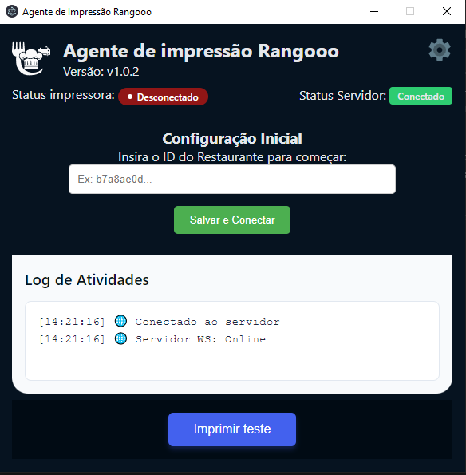

# 🖨️ Agente de Impressão Rangooo



O **Agente de Impressão Rangooo** é um serviço responsável por receber pedidos em tempo real via **WebSocket** e enviá-los automaticamente para impressão local, integrando o **SaaS Rangooo** com impressoras térmicas utilizadas em pizzarias, lanchonetes, restaurantes...

Esse agente resolve um problema clássico do food service:  
👉 **pedido confirmado = impressão imediata**, sem depender de navegador aberto ou ação manual.

---

## 🚀 Visão Geral

- Comunicação em tempo real via **WebSocket**
- Arquitetura simples e desacoplada
- Pensado para rodar localmente no estabelecimento
- Seguro, usando **token de autenticação**
- Base para expansão futura (fila, retry, logs, multi-impressoras)

---

## 🧠 Arquitetura

```
   [SaaS Rangooo]
         |
 WebSocket (pedido)
         ↓
[Agente de Impressão]
         |
 Comando de impressão
         ↓
[Impressora Térmica]
```

---

## 🛠️ Tecnologias Utilizadas

- **Node.js 20+**
- **WebSocket (ws)**
- **JavaScript**
- **dotenv**
- **Impressão térmica (dependente do SO / driver)**

---

## 📦 Estrutura do Projeto

```
├── websocket-server.js # Servidor WebSocket (core do agente)
├── client/ # Lib cliente para envio de pedidos
├── .env.example # Exemplo de variáveis de ambiente
├── package.json
└── README.md
```

---

## 🔐 Autenticação

A conexão é autenticada via **token**, enviado como query string:

```
txt
wss://seu-servidor?token=SEU_TOKEN&saas=true
```

Esse token identifica o restaurante e garante que apenas pedidos autorizados sejam processados.

## 🔁 Fluxo de Impressão

1. **Pedido criado no SaaS**

2. **SaaS envia pedido via WebSocket**

3. **Agente recebe o pedido**

4. **Pedido é enviado para a impressora**

5. **Agente responde com ACK**

6. **SaaS confirma impressão com printId**

### Em caso de falha:

- Timeout controlado

- Retentativas podem ser implementadas

## Autor

Desenvolvido por **Misael Borges**

Fullstack Developer • SaaS • Automação • Tempo Real

```
Projeto criado como parte do ecossistema Rangooo, com foco em soluções reais para o mercado de food service.
```

## 📄 Licença

Este projeto está sob a licença MIT.
